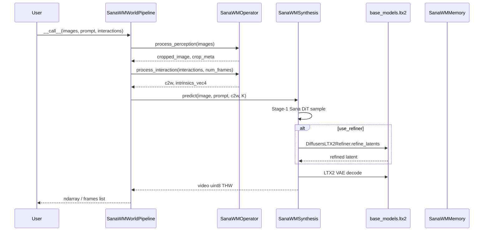

# Sana-WM × OpenWorldLib 集成规划

> **状态**：规划文档（尚未实施代码修改）  
> **上游推理入口**：`/home/dataset-assist-0/usr/lh/hdl/Sana-main/inference_video_scripts/inference_sana_wm.py`  
> **目标框架**：`/home/dataset-assist-0/usr/lh/hdl/OpenWorldLib-open`  
> **关键约束**：将 **LTX-2** 相关组件放入 `base_models`；其余按 OpenWorldLib 五模块 + Pipeline 模板拆分。

### 已确认决策

| 项 | 决定 |
|----|------|
| **代码纳入方式（Vendor）** | **裁剪拷贝（Vendoring）** — 与 Matrix-Game-2 相同，推理所需源码随 OpenWorldLib 仓库一起发版；**不使用** Git Submodule，**不依赖** 运行时 `PYTHONPATH` 指向外部 `Sana-main`。 |
| **目标** | 仓库自包含、CI/克隆即可跑通（权重仍从 HuggingFace 按需下载）。 |

---


## 1. 背景与目标

### 1.1 Sana-WM 能力摘要

Sana-WM 是 **相机可控的 Image-Text-to-Video** 世界模型，核心特征：

| 维度 | 说明 |
|------|------|
| 任务类型 | Navigation / Camera-controlled I2V（非键盘 one-hot 条件，而是 **6-DoF c2w + 内参**） |
| 固定分辨率 | **704 × 1280**（输入图 aspect-preserving resize + center crop） |
| Stage-1 | Sana DiT（`SanaMSVideoCamCtrl_1600M`）+ Flow Euler 采样 |
| Stage-2（默认开启） | **LTX-2 sink-bidirectional Euler Refiner** + LTX2 VAE 解码 |
| 相机输入 | `(F, 4, 4)` c2w **或** WASD/IJKL **action DSL** 字符串 |
| 内参 | `(F, 4)` `[fx, fy, cx, cy]`；可省略时用 **Pi3X** 从首帧估计 |
| 帧数约束 | LTX VAE 要求 `num_frames = 8k + 1`（脚本内 `_snap_num_frames`） |
| 默认权重 | HuggingFace `Efficient-Large-Model/SANA-WM_bidirectional` |

上游已将完整推理封装为 `SanaWMPipeline` 类（同文件 485–870 行），CLI `main()` 仅做参数解析与 I/O。

### 1.2 OpenWorldLib 集成目标

1. **统一 Pipeline 接口**：`from_pretrained` / `__call__` / `stream`，与 Matrix-Game-2、LingBot-World 等导航视频管线一致。  
2. **模块化拆分**：Operator（输入）→ Synthesis（生成）→ Memory（多轮）→ Pipeline（编排）。  
3. **LTX 下沉到 base_models**：Refiner + LTX2 VAE 适配层作为可复用底座，避免仅挂在 Sana 私有目录。  
4. **交互模板对齐**：对外暴露 OpenWorldLib **Navigation Video Generation** 标准 `interactions` 列表；内部映射到 Sana 的轨迹/DSL。  
5. **不破坏上游**：`inference_sana_wm.py` 可继续独立运行；集成层通过 import 或薄封装调用同一套逻辑。

### 1.3 非目标（首期）

- Sana 训练脚本、SOL-RL、Sana-Sprint 等其它产品线。  
- 双向以外的 WM 变体（文档注明当前仅 bidirectional inference）。  
- 在 `predict` / `__call__` 内写盘（遵循框架约定，I/O 由调用方负责）。

---

## 2. 上游代码结构剖析

### 2.1 `inference_sana_wm.py` 逻辑分层

```
┌─────────────────────────────────────────────────────────────────┐
│ CLI (argparse) + main()                                         │
│  - 读图/读 prompt/解析 camera 或 action                         │
│  - resize_and_center_crop + intrinsics 变换                     │
│  - pyrallis 解析 InferenceConfig                                │
│  - 实例化 SanaWMPipeline → generate → write_video / overlay     │
└────────────────────────────┬────────────────────────────────────┘
                             │
┌────────────────────────────▼────────────────────────────────────┐
│ SanaWMPipeline（应迁入 Synthesis + Pipeline 编排）               │
│  _build_vae / _build_text_encoder / _build_model / _build_refiner│
│  generate() → _sample_stage1 → _refine | _decode_with_sana_vae   │
└────────────────────────────┬────────────────────────────────────┘
                             │
        ┌────────────────────┼────────────────────┐
        ▼                    ▼                    ▼
  diffusion/*          LTX Refiner          工具函数（应拆分）
  (DiT/VAE/scheduler)  diffusers_ltx2       action_string_to_c2w
                       _refiner.py          prepare_camera, Pi3X 内参
```

### 2.2 关键依赖包（Sana-main 内）

| 路径 | 职责 |
|------|------|
| `diffusion/model/builder.py` | `build_model`, `get_vae`, `get_tokenizer_and_text_encoder`, `vae_encode/decode` |
| `diffusion/model/nets/*` | Sana / Sana-WM DiT 注册 |
| `diffusion/refiner/diffusers_ltx2_refiner.py` | **LTX-2 Refiner**（diffusers `LTX2VideoTransformer3DModel`） |
| `diffusion/utils/cam_utils.py` | `compute_raymap`, `get_pose_inverse` |
| `diffusion/utils/camctrl_config.py` | `ModelVideoCamCtrlConfig` |
| `diffusion/utils/chunk_utils.py` | chunk index |
| `diffusion/__init__.py` | `FlowEuler`, `LTXFlowEuler`, `DPMS` |
| `sana/tools/hf_utils.py` | `resolve_hf_path` |
| `tools/download.py` | `find_model` |
| `diffusion/utils/action_overlay.py` | 输出视频 WASD 叠加（可选，非核心生成） |

环境要求（来自 `docs/sana_wm.md`）：`environment_setup.sh` → conda `sana`；**必须在 import sana 前** `DISABLE_XFORMERS=1`（torch 2.9 + xformers 兼容性）。

### 2.3 权重与 `required_components` 映射

默认 HF 布局（与 `HF_DEFAULTS` 一致）：

```python
{
    "pretrained_model_path": "Efficient-Large-Model/SANA-WM_bidirectional",  # 根目录
    "dit": "dit/sana_wm_1600m_720p.safetensors",
    "config": "config.yaml",
    "refiner_root": "refiner",                    # transformer/ + connectors/
    "refiner_gemma_root": "refiner/text_encoder", # Gemma for refiner
    "vae": "（config.vae.vae_pretrained，同 repo）",
}
```

`from_pretrained(..., required_components={...})` 应支持上述键的局部覆盖（对齐 Infinite-World / Cosmos 模式）。

---

## 3. OpenWorldLib 对标参考

### 3.1 最相似管线：LingBot-World

| 对比项 | LingBot-World | Sana-WM（目标） |
|--------|---------------|-----------------|
| 任务 | 导航 I2V + prompt | 导航 I2V + prompt |
| Operator | `TrajectoryGenerator` + 标准 action 名 | **需新建** `SanaWMOperator`，复用/扩展轨迹生成 |
| 相机表示 | c2w + K + plucker | c2w + intrinsics → `raymap` + `chunk_plucker` |
| 分辨率 | 480×832（可配） | **固定 704×1280** |
| Synthesis | `LingBotSynthesis.predict` | `SanaWMSynthesis.predict` |
| Memory | `LingBotMemory` | `SanaWMMemory`（末帧续接） |

### 3.2 结构参考：Matrix-Game-2

- 模型代码 **vendor 在** `synthesis/visual_generation/matrix_game/matrix_game_2/`。  
- `base_models` 放 **跨方法共享** 的 Wan VAE 等。  
- **本规划**：LTX 放 `base_models`；Sana DiT 专用代码放 `synthesis/.../sana_wm/`。

### 3.3 交互模板（OpenWorldLib 规范）

Navigation 全量模板（`pi3_operator.NAVIGATION_TEMPLATE` 同源）：

```
forward, backward, left, right,
forward_left, forward_right, backward_left, backward_right,
camera_up, camera_down, camera_l, camera_r,
camera_ul, camera_ur, camera_dl, camera_dr,
camera_zoom_in, camera_zoom_out
```

Sana 原生 **不支持** 全部语义一对一：

| OpenWorldLib | Sana 原生 | 映射策略 |
|--------------|-----------|----------|
| `forward` / `backward` / `left` / `right` | `w` / `s` / `a` / `d` | 直接映射 |
| `forward_left` 等组合 | 同帧多键 | 单帧同时按住多个 WASD |
| `camera_up/down` | `i` / `k` | pitch |
| `camera_l` / `camera_r` | `j` / `l` | yaw |
| `camera_ul` 等对角 | `i+j` 等 | 多旋转键同帧 |
| `camera_zoom_in/out` | **无** | Operator 层用 intrinsics `fx,fy` 缩放模拟，或 **明确报错/降级文档** |
| `camera_view` `[dx,dy,dz,θx,θz]` | 无 | Phase-2：由显式位姿构造 c2w；首期可仅文档说明 |

**帧分配策略**（需在 Operator 配置化）：

- OpenWorldLib：`interactions` 为**有序列表**，每个元素是一步操作。  
- Sana DSL：`<keys>-<frames>` 显式指定每段持续帧数。  
- **建议默认**：`frames_per_interaction = 12`（与 Matrix-Game-2 一致），生成 DSL 如 `w-12,j-12,...`；`num_frames` 由 `len(interactions) * frames_per_interaction + 1` 推导后再 `_snap_num_frames(8k+1)`。

---

## 4. 目标目录结构

```
OpenWorldLib-open/
├── src/openworldlib/
│   ├── base_models/
│   │   └── diffusion_model/
│   │       └── video/
│   │           └── ltx2/                          # ★ LTX 统一底座
│   │               ├── __init__.py
│   │               ├── refiner/
│   │               │   └── diffusers_ltx2_refiner.py   # 自 Sana 迁移
│   │               ├── vae/
│   │               │   └── ltx2_vae_wrapper.py         # 封装 LTX2VAE_diffusers + encode/decode
│   │               └── constants.py                    # STAGE_2_DISTILLED_SIGMA_VALUES 等
│   │
│   ├── operators/
│   │   └── sana_wm_operator.py
│   │
│   ├── synthesis/
│   │   └── visual_generation/
│   │       └── sana/
│   │           ├── sana_wm_synthesis.py           # BaseSynthesis 实现
│   │           └── sana_wm/                       # Sana 专用 vendored 代码
│   │               ├── diffusion/                 # 从 Sana-main 裁剪的最小子树
│   │               ├── sana/tools/
│   │               └── tools/download.py
│   │
│   ├── pipelines/
│   │   └── sana/
│   │       └── pipeline_sana_wm.py
│   │
│   └── memories/
│       └── visual_synthesis/
│           └── sana_wm/
│               └── sana_wm_memory.py
│
├── examples/
│   ├── pipeline_load_mapping.py      # + load_sana_wm_pipeline
│   └── pipeline_infer_mapping.py     # + infer_sana_wm_pipeline
│
├── test/
│   └── test_sana_wm.py
├── test_stream/
│   └── test_sana_wm_stream.py
├── scripts/
│   ├── setup/
│   │   └── sana_wm_install.sh
│   └── test_inference/
│       └── test_nav_video_gen.sh     # + sana-wm 条目
│
└── docs/
    ├── installation.md               # 增补 Sana-WM 依赖
    └── sana_wm_integration_plan.md   # 本文档
```

### 4.1 为何 LTX 放在 `base_models`

用户明确要求 **「把 ltx 放在 base model 下面」**，理由：

1. LTX-2 VAE / Refiner 是 **与 Sana DiT 解耦** 的 Stage-2 解码栈，未来可能被其它视频方法复用。  
2. 与现有 `base_models/diffusion_model/video/wan_2p1|wan_2p2` 层级一致。  
3. `SanaWMSynthesis` 仅 **引用** `base_models.diffusion_model.video.ltx2`，避免 synthesis 目录膨胀。

**边界划分**：

| 组件 | 归属 |
|------|------|
| `DiffusersLTX2Refiner` | `base_models/.../ltx2/refiner/` |
| `LTX2VAE_diffusers` 加载与 tile 编解码 | `base_models/.../ltx2/vae/` |
| `LTXFlowEuler` 采样器 | 保留在 `sana_wm/diffusion/scheduler` 或抽到 `ltx2/sampler`（若仅 Sana 使用则暂留 synthesis） |
| Sana DiT、`ModelVideoCamCtrlConfig`、camctrl blocks | `synthesis/.../sana_wm/diffusion/` |

---

## 5. 模块详细设计

### 5.1 Operator — `SanaWMOperator`

**文件**：`src/openworldlib/operators/sana_wm_operator.py`

**职责**：

1. **校验** `interactions` ⊆ Navigation 模板（不支持项友好报错）。  
2. **`process_perception`**：  
   - 输入 `PIL.Image`  
   - `resize_and_center_crop` → 704×1280  
   - 返回 `cropped_image`, `src_size`, `resized_size`, `crop_offset`（供内参变换）  
3. **`process_interaction`**：  
   - 输入：`interactions: List[str]`, `num_frames`, `frames_per_interaction`, 可选 `camera_trajectory` / `camera_view`  
   - 输出：  
     ```python
     {
       "c2w": np.ndarray,           # (F, 4, 4)
       "intrinsics_vec4": np.ndarray, # (F, 4)
       "action_overlay_c2w": np.ndarray,  # 供 visualize 用（refiner 会 drop 首帧）
     }
     ```  
4. **轨迹生成**（二选一，优先级如下）：  
   - **P0**：`camera_trajectory` 传入 `(F,4,4)` npy 路径或 ndarray → 直接使用  
   - **P0**：`interactions` → 映射到 Sana `action_string_to_c2w`（迁移为 `sana_wm_action.py` 工具模块）  
   - **P1**：`camera_view` 增量位姿  
5. **内参**：  
   - `camera_intrinsics` 参数或文件 → `load_intrinsics`  
   - 否则调用 **Pi3X**（可复用 OpenWorldLib 已有 `representations/.../pi3`，或 vendored 轻量调用）  
   - `transform_intrinsics_for_crop` 与上游一致  

**与 LingBot `TrajectoryGenerator` 的关系**：

- 可 **抽取共享** `navigation_trajectory.py`（放在 `operators/utils/`），统一 OpenCV 坐标系下的 c2w  rollout。  
- Sana 的 `action_string_to_c2w` 与 LingBot 在 **速度标定** 上不同（`translation_speed=0.05`, `rotation_speed_deg=1.2`），Operator 应暴露 `translation_speed` / `rotation_speed_deg` 与上游 CLI 对齐。

**`zoom` 处理（首期）**：

```python
# 方案 A（推荐）：记录 warning，将 zoom 映射为 intrinsics 缩放因子累积
# 方案 B：check_interaction 时拒绝 camera_zoom_* 并提示使用 camera_trajectory
```

### 5.2 Synthesis — `SanaWMSynthesis`

**文件**：`src/openworldlib/synthesis/visual_generation/sana/sana_wm_synthesis.py`

**类接口**（遵循 `BaseSynthesis`）：

```python
class SanaWMSynthesis(BaseSynthesis):
    @classmethod
    def from_pretrained(
        cls,
        pretrained_model_path: str,
        *,
        required_components: dict | None = None,
        device: str | torch.device = "cuda",
        weight_dtype: torch.dtype = torch.bfloat16,
        use_refiner: bool = True,
        offload_vae: bool = False,
        offload_refiner: bool = False,
        **kwargs,
    ) -> "SanaWMSynthesis": ...

    @torch.no_grad()
    def predict(
        self,
        image: Image.Image,              # 已 crop 704×1280
        prompt: str,
        c2w: np.ndarray,
        intrinsics_vec4: np.ndarray,
        *,
        num_frames: int = 161,
        fps: int = 16,
        step: int = 60,
        cfg_scale: float = 5.0,
        flow_shift: float | None = None,
        seed: int = 42,
        negative_prompt: str = "",
        sampling_algo: str = "flow_euler_ltx",
        return_latent: bool = False,
    ) -> np.ndarray | dict: ...
```

**实现策略**：

1. 将 `SanaWMPipeline` **重命名/拆分为** `SanaWMEngine`（内部），由 `SanaWMSynthesis` 持有。  
2. `_build_refiner` 改为 import：  
   `from openworldlib.base_models.diffusion_model.video.ltx2.refiner import DiffusersLTX2Refiner`  
3. VAE 构建走 `ltx2.vae` wrapper（内部仍可调 Sana `get_vae`，但入口统一）。  
4. **`predict` 不写文件**；返回 `(T, H, W, 3) uint8` numpy 或 `dict`（含 `latent`, `c2w` 供 Memory / 调试）。  
5. 模块 import 前设置 `os.environ.setdefault("DISABLE_XFORMERS", "1")`。

**权重加载**：

```python
# pipeline.from_pretrained 示例
SanaWMPipeline.from_pretrained(
    model_path="Efficient-Large-Model/SANA-WM_bidirectional",
    required_components={
        "dit_checkpoint": "hf://.../dit/sana_wm_1600m_720p.safetensors",  # 可选
        "config": "hf://.../config.yaml",
        "refiner_root": "hf://.../refiner",
        "refiner_gemma_root": "hf://.../refiner/text_encoder",
    },
    use_refiner=True,
    device="cuda:0",
)
```

### 5.3 Pipeline — `SanaWMPipeline`（OpenWorldLib）

**文件**：`src/openworldlib/pipelines/sana/pipeline_sana_wm.py`

> 注意：类名与上游 `SanaWMPipeline` 冲突，OpenWorldLib 侧建议命名为 **`SanaWMWorldPipeline`** 或保留 `SanaWMPipeline` 但在不同包路径下（`openworldlib.pipelines.sana`）。

**`from_pretrained`**：

```python
@classmethod
def from_pretrained(cls, model_path, required_components=None, device=None, weight_dtype=None, **kwargs):
    synthesis = SanaWMSynthesis.from_pretrained(model_path, required_components=..., ...)
    operators = SanaWMOperator()
    memory = SanaWMMemory()
    return cls(operators=operators, synthesis_model=synthesis, memory_module=memory, ...)
```

**`process`**：

```python
def process(self, images, prompt, interactions, num_frames, intrinsics=None, camera_trajectory=None, ...):
    perception = self.operators.process_perception(images)
    self.operators.get_interaction(interactions)  # 或包装为单次 list
    cam = self.operators.process_interaction(
        num_frames=num_frames,
        frames_per_interaction=...,
        intrinsics=intrinsics,
        camera_trajectory=camera_trajectory,
        crop_meta=perception,
    )
    return {**perception, **cam, "prompt": prompt}
```

**`__call__`**（对齐统一参数表）：

| 参数 | Sana-WM 用法 |
|------|----------------|
| `images` | 首帧 PIL，必填 |
| `prompt` | 文本指令，必填 |
| `interactions` | 导航动作列表；与 `camera_trajectory` 二选一 |
| `camera_trajectory` | `(F,4,4)` 或 `.npy` 路径 |
| `num_frames` | 总帧数，默认自动 snap 到 `8k+1` |
| `fps` | 默认 16 |
| `seed` | 透传 |
| `size` | **忽略或固定 (704,1280)**，传入时 warning |
| `visualize_ops` | 映射 `apply_overlay`（WASD 叠加） |

**`stream`**：

1. `memory.select()` → 上一段末帧或初始图  
2. `__call__`  
3. `memory.record(video)` — 存末帧 / 全片段（与 Matrix-Game-2 对齐）

### 5.4 Memory — `SanaWMMemory`

**文件**：`src/openworldlib/memories/visual_synthesis/sana_wm/sana_wm_memory.py`

- 继承 `BaseMemory`  
- `record`：保存 `PIL.Image`（末帧）或 `uint8` 视频最后一帧  
- `select`：返回最近一次图像供下一 turn I2V  
- **可选**：保存上一段 `c2w` 末帧位姿作为下一段起点（Phase-2 时序连续）

### 5.5 Reasoning / Representation

**首期不新增** Reasoning 模块。  

**Representation 可选协作**：

- 内参估计：复用 **Pi3**（OpenWorldLib 已有 `Pi3Representation` / operator），避免在 Synthesis 路径重复加载 Pi3X。  
- 设计建议：`SanaWMOperator.process_perception` 接受 `intrinsics` 由 Pipeline 注入；若 `None` 且 `estimate_intrinsics=True`，Pipeline 可先调 Pi3 再传入。

---

## 6. 代码迁移与 vendoring 策略（已选：裁剪拷贝）

与 **Matrix-Game-2**（`synthesis/.../matrix_game_2/` 内嵌上游代码）一致：从 `Sana-main` **一次性裁剪复制**推理最小子集到 OpenWorldLib，改 import 为 `openworldlib` 包内路径；**不**添加 `submodules/Sana-main`，**不**要求用户本机另装 Sana 仓库。

### 6.1 分层拷贝表

| 层级 | 源（`Sana-main`） | 目标（OpenWorldLib） | 说明 |
|------|-------------------|----------------------|------|
| **LTX Refiner** | `diffusion/refiner/diffusers_ltx2_refiner.py` | `base_models/diffusion_model/video/ltx2/refiner/` | 改 import；常量可放 `ltx2/constants.py` |
| **LTX VAE 封装** | `diffusion/model/builder.py` 中 LTX2 相关逻辑 | `base_models/.../ltx2/vae/ltx2_vae_wrapper.py` | 对外统一 encode/decode API |
| **Sana DiT + 调度** | `diffusion/`（除已迁 LTX refiner） | `synthesis/visual_generation/sana/sana_wm/diffusion/` | 包名建议 **`sana_wm_diffusion`**，避免与全局 `diffusion` 冲突 |
| **HF / 权重工具** | `sana/tools/hf_utils.py`, `tools/download.py` | `synthesis/.../sana_wm/sana/tools/`, `.../tools/` | 保持 `resolve_hf_path` / `find_model` 行为 |
| **推理工具（非模型）** | `inference_sana_wm.py` 中相机/DSL 函数 | `operators/utils/sana_wm_cam.py` | 不拷贝整份 CLI 脚本 |
| **上游 CLI** | `Sana-main/inference_video_scripts/inference_sana_wm.py` | **不纳入** OpenWorldLib | 可选 Phase-6：改为 thin wrapper 调 `openworldlib`（非阻塞） |

### 6.2 裁剪最小文件集（实施清单）

从 `/home/dataset-assist-0/usr/lh/hdl/Sana-main` 按依赖闭包逐项核对，首期至少包含：

```
synthesis/visual_generation/sana/sana_wm/
  sana_wm_diffusion/                    # 重命名后的 diffusion 子树
    __init__.py                         # FlowEuler, LTXFlowEuler, DPMS
    model/
      builder.py
      nets/                             # 仅 Sana-WM / CamCtrl 相关 net 文件
      utils/                            # cam_utils, camctrl_config, chunk_utils, ...
    scheduler/
      flow_euler_sampler.py
    utils/
      config.py, logger.py, ...
  sana/tools/hf_utils.py
  tools/download.py
```

**明确不拷贝**：`train_*`、`configs/sol_rl`、`app/`、`scripts/inference*.py`、测试与文档站资源。

**LTX refiner 原路径** `diffusion/refiner/diffusers_ltx2_refiner.py` 只保留一份，位于 `base_models/.../ltx2/`，`sana_wm_diffusion` 内不再保留 `refiner/` 目录。

### 6.3 包名与 import 约定

```python
# Synthesis 内加载 DiT
from openworldlib.synthesis.visual_generation.sana.sana_wm.sana_wm_diffusion.model.builder import build_model, get_vae, ...

# LTX 仅从 base_models 引用
from openworldlib.base_models.diffusion_model.video.ltx2.refiner import DiffusersLTX2Refiner
```

实施时在 `sana_wm_synthesis.py` 顶部设置 `os.environ.setdefault("DISABLE_XFORMERS", "1")`（与上游一致）。

### 6.4 LICENSE 与上游同步

- Sana 上游为 **Apache-2.0**；拷贝文件保留文件头版权与 SPDX 标识（与 Matrix-Game-2 vendor 目录做法一致）。  
- 在 `synthesis/.../sana_wm/README.vendor.md` 记录：**源仓库**、**源 commit/tag**、**裁剪日期**、**裁剪文件列表**，便于日后 diff 升级。  
- 升级流程：对比 `NVlabs/Sana` 新 tag → 对 vendor 目录做 patch，跑 `test_sana_wm.py` 回归。

### 6.5 CI / 发版收益（选用本方式的原因）

- `git clone OpenWorldLib` + `pip install -e .` 即可 import，无需额外 clone Sana。  
- CI 脚本与 Docker 镜像不必挂载 `Sana-main`。  
- 版本与 OpenWorldLib release tag 一一对应，复现性优于 `PYTHONPATH`。

需在 `scripts/setup/sana_wm_install.sh` 中验证 **vendor 目录 import 链**完整（Phase 0/3 验收项）。

### 6.6 环境依赖（`requirements` / 安装脚本）

在 `docs/installation.md` 增加独立章节 **Sana-WM**：

```
- torch >= 2.x（与 Sana 对齐）
- diffusers（含 LTX2 模型类）
- transformers（Gemma-2-2b-it）
- pyrallis, imageio, safetensors
- pi3（若使用 Pi3X 内参估计）
- 可选：xformers 禁用策略见 DISABLE_XFORMERS
```

GPU 显存参考上游：Stage-1 + Refiner 同卡；`offload_vae` / `offload_refiner` 暴露给 `from_pretrained`。

---

## 7. 交互与数据流（端到端）



---

## 8. Examples / 测试 / Benchmark 接入

### 8.1 `pipeline_load_mapping.py`

```python
def load_sana_wm_pipeline(model_path, device):
    from openworldlib.pipelines.sana.pipeline_sana_wm import SanaWMWorldPipeline
    return SanaWMWorldPipeline.from_pretrained(
        model_path=_resolve_path(model_path, "pretrained_model_path"),
        required_components={...},  # 从 dict 解析 refiner 等
        device=device,
    )

video_gen_pipe["sana-wm"] = load_sana_wm_pipeline
```

### 8.2 `pipeline_infer_mapping.py`

```python
def infer_sana_wm_pipeline(pipe, input_image, interaction_signal, prompt, output_path=None, fps=16, **kwargs):
    num_frames = kwargs.get("num_frames") or _default_sana_wm_frames(len(interaction_signal))
    video = pipe(images=input_image, prompt=prompt, interactions=interaction_signal, num_frames=num_frames, **kwargs)
    if output_path:
        imageio.mimsave(output_path, video, fps=fps)
    return video
```

### 8.3 测试用例

| 文件 | 内容 |
|------|------|
| `test/test_sana_wm.py` | 单轮：demo 图 + prompt + `["forward","camera_r"]` |
| `test_stream/test_sana_wm_stream.py` | 多轮 stream + Memory |
| `scripts/test_inference/test_nav_video_gen.sh` | 增加 `sana-wm` case |

### 8.4 Benchmark

`examples/evaluation_tasks/navigation_video_generation.py` 中注册 `sana-wm` 方法键，与 Matrix-Game-2 共用交互序列 JSON。

---

## 9. 分阶段实施计划

### Phase 0 — 准备（0.5–1 天）

- [ ] 固定上游基线：记录 `Sana-main` 的 git commit（写入 `README.vendor.md`）  
- [ ] 确认 HF 权重 `Efficient-Large-Model/SANA-WM_bidirectional` 可下载  
- [ ] 在 OpenWorldLib 分支 `sana` 上创建目录骨架  
- [ ] **裁剪拷贝**：按 §6.2 从 `Sana-main` 复制最小文件集到 `sana_wm/` 与 `ltx2/`  
- [ ] 包名隔离：使用 `sana_wm_diffusion`，避免与 `diffusion_model` 及第三方 `diffusion` 冲突  
- [ ] 添加 `README.vendor.md`（源 commit、文件清单、LICENSE 说明）

### Phase 1 — base_models LTX（1–2 天）

- [ ] 迁移 `diffusers_ltx2_refiner.py` → `base_models/diffusion_model/video/ltx2/refiner/`  
- [ ] 实现 `ltx2_vae_wrapper.py`（封装 `LTX2VAE_diffusers` encode/decode + tiling 参数）  
- [ ] 单元测试：仅加载 refiner + dummy latent shape（不跑全 DiT）

### Phase 2 — Operator + 工具函数（1–2 天）

- [ ] 迁移 `action_string_to_c2w`, `load_intrinsics`, `prepare_camera`, `resize_and_center_crop` 至 `operators/utils/sana_wm_cam.py`  
- [ ] 实现 `SanaWMOperator` + OpenWorldLib interaction → DSL 映射  
- [ ] 内参：对接 Pi3 或保留 Pi3X 轻量路径

### Phase 3 — Synthesis（2–3 天）

- [ ] 完成 §6.2 裁剪拷贝，批量修正 `sana_wm_diffusion` 内部相对 import  
- [ ] 实现 `SanaWMSynthesis.from_pretrained` / `predict`（逻辑来自上游 `SanaWMPipeline`）  
- [ ] 接入 `base_models.ltx2` refiner/vae（Synthesis 不再引用 vendor 内 refiner 路径）

### Phase 4 — Pipeline + Memory + Examples（1 天）

- [ ] `SanaWMWorldPipeline`：`process` / `__call__` / `stream`  
- [ ] `SanaWMMemory`  
- [ ] 更新 `pipeline_load_mapping` / `pipeline_infer_mapping`

### Phase 5 — 测试与文档（1 天）

- [ ] `test_sana_wm.py` / stream 测试  
- [ ] `sana_wm_install.sh` + `installation.md`  
- [ ] `docs/planning.md` 方法表增加 Sana-WM 行

### Phase 6 — 优化（可选）

- [ ] `camera_view` 显式位姿 API  
- [ ] `camera_zoom` 内参模拟  
- [ ] 与 Pi3 pipeline 组合：Pi3 估计 K + Sana 生成  
- [ ] NVFP4 / 蒸馏版权重开关

---

## 10. 风险与对策

| 风险 | 影响 | 对策 |
|------|------|------|
| `diffusion` 包名与全局冲突 | import 失败 | **已选方案**：vendor 目录统一为 `sana_wm_diffusion`，禁止裸 `import diffusion` |
| 显存不足（DiT + Refiner + Gemma） | OOM | 默认开启 `offload_refiner` 文档推荐；暴露 CLI 参数 |
| 交互语义不一致（zoom 等） | 用户困惑 | Operator 明确报错表；文档列出支持子集 |
| `num_frames` 非 `8k+1` | 推理失败 | Pipeline 内统一 `_snap_num_frames` |
| Pi3X 与 OpenWorldLib Pi3 重复加载 | 双倍显存 | 统一内参服务接口，单例加载 |
| xformers 兼容性 | 注意力数值问题 | 强制 `DISABLE_XFORMERS=1` |
| 固定分辨率 | 与 `size` 参数冲突 | `__call__` 忽略 `size` 并 document |

---

## 11. 验收标准

1. **API 一致性**：`Pipeline.from_pretrained(...)(images=..., prompt=..., interactions=...)` 可返回 `uint8` 视频 ndarray，无内部写盘。  
2. **LTX 位置**：`DiffusersLTX2Refiner` 仅从 `openworldlib.base_models.diffusion_model.video.ltx2` import。  
3. **导航模板**：至少支持 `forward/backward/left/right` + `camera_l/camera_r` + `camera_up/camera_down` 与组合移动。  
4. **stream**：两轮交互后末帧续接可生成第二段视频。  
5. **对标上游**：同一 `--image/--prompt/--action` 与原生 `inference_sana_wm.py` 输出 **视觉一致**（允许 seed 差异下结构一致）。  
6. **Examples**：`python examples/run_benchmark.py --method sana-wm`（或等价入口）可跑通。

---

## 12. 开放问题（实施前需确认）

**已关闭**

- ~~**Vendor 方式**~~ → **裁剪拷贝（Vendoring）**，见文首「已确认决策」与 §6。

**仍待确认**

1. **类名**：OpenWorldLib `SanaWMPipeline` vs `SanaWMWorldPipeline` 是否重命名以避免与上游混淆。  
2. **`frames_per_interaction` 默认值**：12（对齐 Matrix-Game）vs 上游 action DSL 自定义帧数。  
3. **`camera_zoom_*`**：模拟内参 vs 首期不支持。  
4. **Pi3X 依赖**：是否必须纳入 `requirements.txt`，或标为 optional extra `[sana-wm]`。  
5. **上游 CLI**：`Sana-main/inference_sana_wm.py` 是否后续改为 thin wrapper（低优先级，不阻塞 OpenWorldLib 发版）。

---

## 13. 附录：关键常量与默认超参

```python
TARGET_HEIGHT = 704
TARGET_WIDTH = 1280
HF_REPO = "Efficient-Large-Model/SANA-WM_bidirectional"

# GenerationParams 默认
num_frames = 161
fps = 16
step = 60
cfg_scale = 5.0
sampling_algo = "flow_euler_ltx"  # | flow_euler | flow_dpm-solver

# Action rollout 默认
DEFAULT_TRANSLATION_SPEED = 0.05
DEFAULT_ROTATION_SPEED_DEG = 1.2
ALLOWED_ACTION_KEYS = wasdijkl

# Refiner
STAGE_2_DISTILLED_SIGMA_VALUES = (0.909375, 0.725, 0.421875, 0.0)
sink_size = 1
```

---

## 14. 总结

本集成将 **Sana-WM** 定位为 OpenWorldLib 的 **Navigation Video Generation** 管线之一：Operator 负责将标准 `interactions` 转为 c2w/内参并做 704×1280 预处理；Synthesis 承载 Sana DiT 采样；**LTX-2 Refiner/VAE 沉入 `base_models/diffusion_model/video/ltx2`**；Pipeline/Memory 提供与其它世界模型一致的 `__call__`/`stream` 体验。源码采用 **裁剪拷贝** 纳入仓库（同 Matrix-Game-2），保证 CI/发版自包含。按 Phase 0→5 递进可在约 **6–9 人天** 完成可合并的首发版本，后续再补 zoom、`camera_view` 与 Pi3 联合推理等增强能力。
